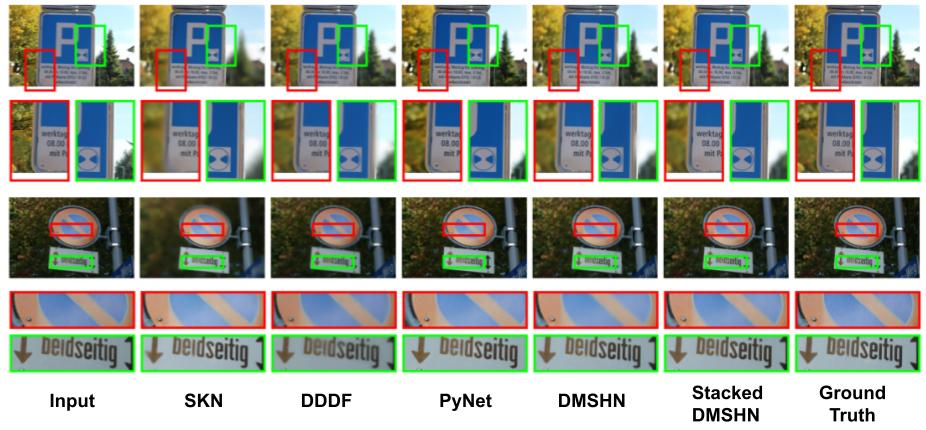

# Stacked Deep Multi-Scale Hierarchical Network for Fast Bokeh Effect Rendering from a Single Image
_Saikat Dutta, Sourya Dipta Das, Nisarg A. Shah and Anil Kumar Tiwari_

Accepted at Mobile AI workshop, co-located with CVPR 2021 [Paper](https://openaccess.thecvf.com/content/CVPR2021W/MAI/html/Dutta_Stacked_Deep_Multi-Scale_Hierarchical_Network_for_Fast_Bokeh_Effect_Rendering_CVPRW_2021_paper.html) | [ArXiv](https://arxiv.org/abs/2105.07174) | [Supplementary](https://drive.google.com/file/d/1MLGZ_I10SfrvlTlXAvVVxbIOgmWUxiPr/view?usp=sharing) | [YouTube](https://www.youtube.com/watch?v=yyOAyv5iWmU)

Pytorch 1.1.0 Torchvision 0.3.0 skimage 0.16.2

[**Colab demo**](https://colab.research.google.com/drive/1zl2_QOWjoWaN0bzDHSKJETkDgIiI62d0?usp=sharing)





### 1. Dataset:

Get the EBB! dataset by registering [here](https://competitions.codalab.org/competitions/24716).

Train split: data/train.csv

Test split (val294 set): data/test.csv 

### 2. Run inference on Val294 set using DMSHN model:
```
python DMSHN_test.py
```
### 3. Run inference on Val294 set using Stacked DMSHN model:
```
python stacked_DMSHN_test.py
```
### 4. To generate PSNR, SSIM and LPIPS scores on output images:
```
python eval.py -d0 OUT_DIR -d1 GT_DIR --use_gpu 
```
### 5. Citation:
```
@inproceedings{dutta2021stacked,
  title={Stacked Deep Multi-Scale Hierarchical Network for Fast Bokeh Effect Rendering from a Single Image},
  author={Dutta, Saikat and Das, Sourya Dipta and Shah, Nisarg A and Tiwari, Anil Kumar},
  booktitle={Proceedings of the IEEE/CVF Conference on Computer Vision and Pattern Recognition},
  pages={2398--2407},
  year={2021}
}
```

### 6. Related work:

[1] Dutta, Saikat. "Depth-aware blending of smoothed images for bokeh effect generation." Journal of Visual Communication and Image Representation (2021): 103089. [Paper](https://www.sciencedirect.com/science/article/abs/pii/S1047320321000511) [ArXiv](https://arxiv.org/abs/2005.14214) [Project page](https://github.com/saikatdutta/dbsi_bokeh/)

[2] Das, Sourya Dipta, and Saikat Dutta. "Fast deep multi-patch hierarchical network for nonhomogeneous image dehazing." Proceedings of the IEEE/CVF Conference on Computer Vision and Pattern Recognition Workshops. 2020. [Paper](https://openaccess.thecvf.com/content_CVPRW_2020/html/w31/Das_Fast_Deep_Multi-Patch_Hierarchical_Network_for_Nonhomogeneous_Image_Dehazing_CVPRW_2020_paper.html) [ArXiv](https://arxiv.org/abs/2005.05999) [Code](https://github.com/diptamath/Nonhomogeneous_Image_Dehazing)


### 7. Useful Repositories:

[1] [SSIM loss](https://github.com/Po-Hsun-Su/pytorch-ssim)

[2] [MSSSIM loss](https://github.com/jorge-pessoa/pytorch-msssim)

[3] [LPIPS](https://github.com/richzhang/PerceptualSimilarity)
